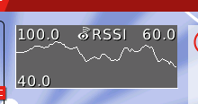

#Graph widget for OpenTX

Download the latest version: https://raw.githubusercontent.com/RealTadango/FrSky/master/Graph/Graph.lua

Installation:
Copy Graph.lua to WIDGETS\Graph on the SD card and you can select it as a Widget.

This widget was designed to provide real-time graphing to OpenTX on the FrSky Horus radio.
Possible usages are: Rssi strength / battery voltage monitoring, altitude plotting for gliders ect.

The graph captures data from the selected source and stores a maximum of 100 measurements. The interval
determines the time between each measurement. The interval can be calculated with this formula:
10 * interval * interval = milliseconds between each measurement. The interval update rate is limited 
by the lua widget refresh which seems to be about 100mSec or 10 measurements per second. The interval 1 
to 3 have the same timespan. The interval range is 1 to 35, 10mSec to 12,25sec. That would create a 
graph with a timespan of 1 second to 20.4 minutes. The default interval of 8 would give a graph length
of about 1 minute.

The graph has 2 operating modes: Small and normal. In small mode the graph does not display the source,
min, max and current value and does not automatically scale the range. In normal mode the source, min, 
max and current values are also display on the screen. The graph is automatically scaling if the measured 
value is out of the min and max range. The min and max range option are used to create the minimum range 
to display.

If there are no measurements available the graph is empty without numbers and with only the borders. If
any of the settings are change the chart is resetted.