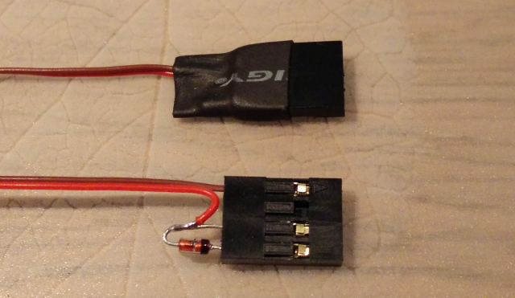
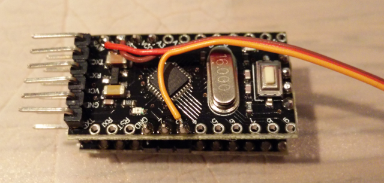
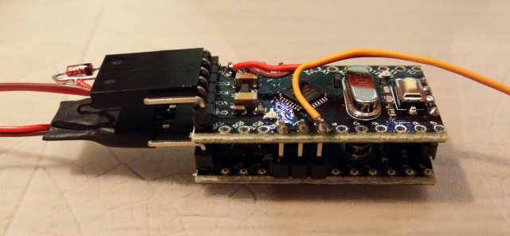
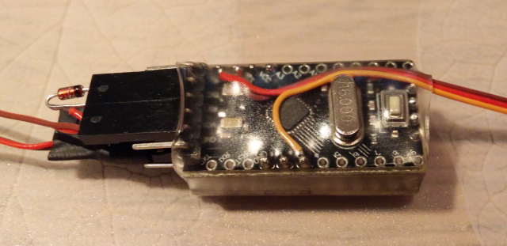

# FrSky
My sensor and lua collection for FrSky Horus and X series receivers with a S.Port

Lua scripts:
 - [LView](https://github.com/RealTadango/FrSky/tree/master/LView): Grahical log file viewer
 - [Graph](https://github.com/RealTadango/FrSky/tree/master/Graph): Graphing widget for telemetry
 - [Gauge](https://github.com/RealTadango/FrSky/tree/master/Gauge): Guage widget for telemetry
 - [RBSMIX](https://github.com/RealTadango/FrSky/tree/master/RBSMIX): Mixer script for additional Redundancy bus telemetry counters
 - [Stall](https://github.com/RealTadango/FrSky/tree/master/Stall): Mixer script used as a landing assist with overspeed callout and stall warning
 - [Start](https://github.com/RealTadango/FrSky/tree/master/Start): Autostart mixer script, basically a delayed timer for auto throttle / elevator / flight mode
 - [RAS](https://github.com/RealTadango/FrSky/tree/master/RAS): RAS mixer script. This adds a virtual sensor for the RAS (SWR) value

## S.Port Sensors Build instructions

There is not much to build but a few images explain is the easiest way.

The sensors use an Atmega 328 arduino like a Arduino Nano or Mini. Many are usable although the code has been tested on:
 - Arduino Mini (Atmega 328 16Mhz)
 - Arduino Pro Mini (Atmega 328 16Mhz)
 - Arduino Nano (Atmega 328 16Mhz)

An Arduino Pro Mini clone is my favorite since it is small and cheap. The hardware serial port is used to connect to an ECU or Powerbox. To create a single wire port a standard general purpose signal diode is used (1N4151 for example) between the TX and RX port.

This diode can be soldered on the board directly but that creates a big issue: The board cannot be updated over the serial port anymore. You can upload the sketch and then add the diode but I have used an alternative method. I added the diode in the connector cable to the ECU or powerbox that will be removed when flashing. The ring of the diode connects to the TX port and the other side to the RX port. The signal cable connects to the RX port.

If you don't use the pin header connector it will be much smaller but in most planes there will be lots of room.

The S.Port connection is set on RB3 (no specific reason, can be changed) and the S.Port cable powers the sensor also. Make sure you connect the positive wire from the S.Port to the RAW input of the Arduino so the regulator is used. This way 2s Lipo power is no problem for the sensor.

Because i need 2 sensors in my plane i stacked 2 boards saving space and wires. Both RB3 pins are connected together as are GND and RAW. There are a few more unused pins connected to create a more solid stack, but they have no other function.

Flashing can be done by simple attaching a FTDI adapter from ebay (not needed with a Arduino Nano or other with builtin USB) and uploading the sketch. For the ECU sketch a choice has to be made for Xicoy or Jetronic by commenting out #define ECU_JETRONIC or #define ECU_FADEC

I added some transparent shrink wrap so i can still see the LED's (they have no function yet but that will be added)

